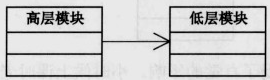
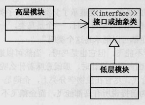

# design-patterns

面向对象的优点
1. 面向对象优点: 可维护，可扩展，可复用和灵活性好
2. 易插拔: 强内聚、松耦合

面向对象设计原则：
1. 单一职责原则: 就一个类而言，应该仅有一个引起它变化的原因
   如果一个类承担的职责过多，就等于把这些职责耦合在一起，一个职责的变的化可能会削弱或抑制这个类完成其他职责的能力，
   这种耦合会导致脆弱的设计，当变化发生时，设计会遭受意想不到的破坏。
   软件设计真正要做的许多内容，就是发现职责并把那些职责相互分离。
   
   如何判断是否应该分离出类来？
   如果你能够想到多于一个的动机去改变一个类，那么这个类就具有多于一个的职责
2. 开放-封闭原则 
3. 依赖倒转原则：抽象不应该依赖细节，细节应该依赖于抽象。说白了：要针对接口编程，不要对实现编程
    - 高层模块不应该依赖低层模块。两个都应该依赖抽象(接口或抽象类)
      - 原因：面向过程的开发时，为了使得常用代码可以复用，一般都会把这些常用代码写成许许多多函数的程序库，
       这样我们在做新项目时，去调用这些低层的函数就可以了。比如我们做项目大多要访问数据库，所以我们就把访问数据库
      的代码写成了函数，每次做新项目时就去调用这些函数。这也就是高层模块依赖低层模块。但做新项目时，发现业务逻辑
      的高层模块都是一样的，但客户希望使用不同数据库或存储信息方式，这时就出现麻烦了，高层模块都是与低层的访问数
      据库绑定在一起，没办法复用这些高层模块，这就非常槽糕了。 
       
      而如果不管高层模块还是低层模块，它们都依赖于抽象，
      具体一点就是接口或抽象类，只要接口是稳定的，那么任何一个的更改都不用担心其他受到影响，这就使得无论高层模块
      还是低层模块都可以很容易地被复用。
    - 抽象不应该依赖细节。细节应该像这种抽象
4. 里氏代换原则
    子类型必须能替换掉它们的父类型
    一个软件实体如果使用的是一个父类的话，那么一定适用于其子类，而且它察觉不出父类对象和子类对象的区别。也就是说，
    在软件里面，把父类都替换成它的子类，程序行为没有变化
5. 迪米特法则
    如果两个类不必彼此直接通信，那么这两个类就不应当直接的相互作用。如果其中一个类需要调用另一个类的某个方法的话，
    可以通过第三者转发这个调用。

# 设计模式的类型
1. 创建型模式（Creational Pattern）：用于构建对象，以便它们可以实现系统中分离出来
2. 结构型模式（Structural Pattern）：用于在许多不同的对象之间形成大型对象结构
3. 行为型模式（Behavioral Pattern）：用于管理对象之间的算法、关系和职责

# 结构型设计模式
    结构型设计模式的主要用途是将一种对象改装为另一种对象，或将小对象拼接成对象。
    结构型设计模式有有一个主题：适配接口(adapt interface)、增加功能(add functionality)和处理对象群集(handle collections of object)
    
    1. 适配器模式 (Adapter Pattern)
       适配器模式是一种接口适配技术，可通过某个类来使用另一个接口与之不兼容的类
    2. 桥接模式 (Bridge Pattern)
       桥接模式用于将"抽象（比如接口或算法）"与实现方式相分离  
    3. 装饰者模式（Decorator Pattern）
       动态地给一个对象添加一些额外的职责，就增加功能来说，装饰模式比生成子类更为灵活
          

