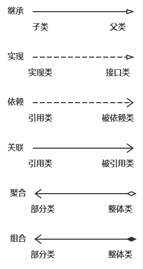
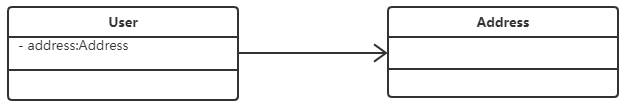
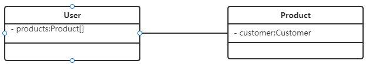
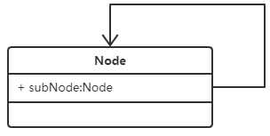
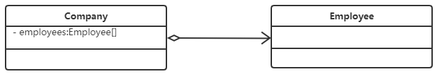
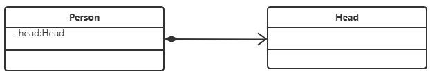
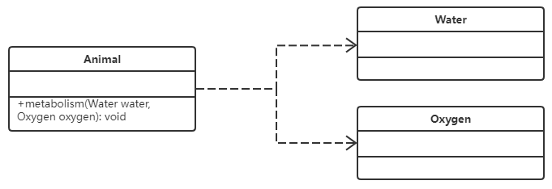

# UML类图概述
## 什么是类图？
统一建模语言（Unified Modeling Language，缩写UML）
## 类图的作用？

UML展现了一系列最佳工程实践，这些最佳实践在对大规模，复杂系统进行建模方面，特别是软件架构层次方面已经被验证有效。
我们这次介绍的主要是类图，为了解析项目的系统结构和架构层次，可以简洁明了的帮助我们理解项目中类之间的关系。

类图的作用：

1. 在软件工程中，类图是一种静态的结构图，描述了系统的类的集合，类的属性和类之间的关系，可以简化了人们对系统的理解；

2. 类图是系统分析和设计阶段的重要产物，是系统编码和测试的重要模型。

# 类图格式 
类使用包含类名，属性和方法且带有分割线的矩形来表示，如下：


- \+ ：表示public

- \- ：表示private

- \# ：表示protected（friendly也归入这类）

属性的完整表示：可见性  名称 ：类型 [ = 缺省值]

方法的完整表示：可见性  名称(参数列表) [ ： 返回类型]

如果是抽象类与接口，类名需要用斜体表示

类图中类与类之间的关系：继承、实现、依赖、关联、聚合、组合这六大类型，表示如下图



# 类与类之间的关系表达
## 继承关系
1. UML类图表示：

2. 代码表示：
     ```python
    class Animal:
        def __init__(self, name):
            self.name = name
    
    class Dog(Animal):
        def __init__(self, name):
            super().__init__(name)
    
    class Cat(Animal):
        def __init__(self, name):
            super().__init__(name)
      ```

## 接口实现关系
1. UML类图表示：

2. 代码表示：
    ```python
    class Vehice:
        def __init__(self):
            pass
        
        def move(self):
            return NotImplementedError
    
    class Ship(Vehice):
        def __init__(self):
            pass
            
        def move(self):
            print('the ship is moving')
    
    class Car(Vehice):
        def __init__(self):
            pass
            
        def move(self):
            print('the car is moving')
    ```

## 关联关系
关联关系描述的是对象与对象的关系，当一个对象‘知道’另一个对象时，可以用关联。
### 单向关联：用实线箭头来表示
1. UML类图表示：
  
2. 代码表示如下：
    ```python
    class User:
        def __init__(self, address: Address):
            self.address = address
    ```

### 双向关联
 1. UML类图如下：
 
 2. 代码表示如下：
    ```python
    class  User:
        def __init__(self):
            self.products = []
        
        def add_product(self, product: Product):
            self.products.append(product)

    class  Product:
        def __init__(self, user: User):
            self.user = user
    ```

### 自关联
1. UML类图表示：<br>

  
2. 代码表示如下：
    ```python
    class  Node:
        def __init__(self, subNode: Node):
            self.subNode = subNode
   ```
    
## 聚合关系
   聚合关系体现的是`整体`与`部分`的关系。整体与部分之间是可分离的，可以具有各自的生命周期，`部分`可以脱离`整体`而单独存在。
   
   比如：汽车包含了发动机，而发动机脱离了汽车也能单独存在, 公司与员工的关系。
   
1. UML类图表示：

   
2. 表现在代码层面，和关联关系是一致的，只能从语义级别来区分
   ```python
    class  Company:
        def __init__(self):
            self.employees = []
            
        def add_employee(self, employee: Employee):
            self.employees.append(employee)
            
    class  Employee:
        def __init__(self, company: Company):
            self.company = company
    ```

## 组合关系
组合关系与聚合关系见得最大不同在于：这里的“部分”脱离了“整体”便不复存在。整体的生命周期结束也就意味着部分的生命周期结束
比如人和大脑的关系，

1. UML类图表示：

   
2. 表现在代码层面，和关联关系是一致的，只能从语义级别来区分
   ```python
    class  Person:
        def __init__(self, head: Head):
            self.head = head
            
    class  Head:
        def __init__(self):
            pass
    ```

## 依赖关系
就是一个类A使用到了另一个类B，而这种使用关系是具有偶然性的、临时性的、非常弱的，但是B类的变化会影响到A；比如某人要过
河，需要借用一条船，此时人与船之间的关系就是依赖；表现在代码层面，为类B作为参数被类A在某个method方法中使用

比如：动物依赖氧气和水，动物调用新陈代谢方法需要氧气类与水类的实例作为参数

1. UML类图表示：

   
2. 代码表示如下：
   ```python
    class  Animal:
        def __init__(self):
            pass
            
        def metabolism(self,water: Water, oxygen: Oxygen):
            pass
            
    class  Water:
        def __init__(self):
            pass
    
    class  Oxygen:
        def __init__(self):
            pass
    ```


